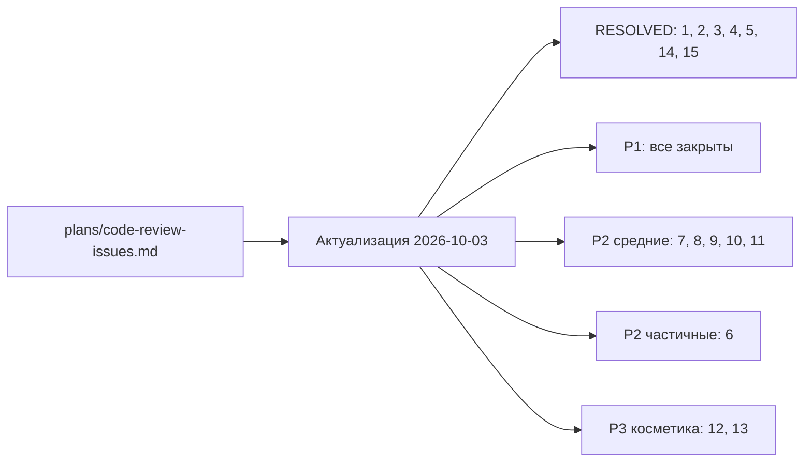

# Фиксы по ревью кодовой базы exdbnein — индекс задач

> Актуализировано: 2026-10-02. Источник: [`plans/code-review-issues.md`](../code-review-issues.md)
> (исторический документ ревью; статусы в нём устарели — актуальная картина здесь).

## Сводка

Ревью выявило 15 пунктов. При сверке с текущим кодом:

| Категория | Итог |
|-----------|-----:|
| 🔴 Критические | 0 открыто · 0 частично · 4 закрыто (#1, #2, #3, #4) |
| 🟡 Средние | 3 открыто · 2 частично (#6, #7) · 1 закрыто (#5) |
| 🟢 Косметические | 2 открыто · 0 частично · 2 закрыто (#14, #15) |
| **Всего** | **5 открыто · 2 частично · 7 закрыто** |

Суммарно: **7 задач на исправление** (по одному файлу на пункт в этой директории)
+ **7 закрытых пунктов** описаны в [`RESOLVED.md`](./RESOLVED.md) с доказательствами,
чтобы их не открывали заново.



## Таблица задач

| ID | Приоритет | Статус | Задача | Файл задачи |
|----|-----------|--------|--------|-------------|
| #1 | 🔴 P1 | ✅ Закрыто | LiveCD-носитель блокирует все диски вне LiveCD | [RESOLVED.md](./RESOLVED.md#1-livecd-носитель-блокирует-все-диски-вне-livecd-исправлено) |
| #2 | 🔴 P1 | ✅ Закрыто | `planAptUpdate` — ложная идемпотентность при частичных списках | [RESOLVED.md](./RESOLVED.md#2-planaptupdate--ложная-идемпотентность-при-частичных-списках-исправлено) |
| #3 | 🔴 P1 | ✅ Закрыто | `onStepDone` вызывается при навигации `back` — неконсистентный черновик | [RESOLVED.md](./RESOLVED.md#3-onstepdone-вызывается-при-навигации-back--неконсистентный-черновик-исправлено) |
| #4 | 🔴 P1 | ✅ Закрыто | Plaintext-пароль не очищается в памяти | [RESOLVED.md](./RESOLVED.md#4-plaintext-пароль-legacy-поле-в-конфиге-и-очистка-из-памяти-исправлено) |
| #5 | 🔴 P1 | ✅ Закрыто | Seed-том с конфигом не читается установщиком | [RESOLVED.md](./RESOLVED.md#5-seed-том-с-конфигом-реализован) |
| #6 | 🟡 P2 | Частично исправлено | `diskPreparationState` без проверки GPT/MBR | [P2-disk-state-gpt-mbr.md](./P2-disk-state-gpt-mbr.md) |
| #7 | 🟡 P2 | Частично исправлено | `isGrubInstalled` не проверяет битый/неполный GRUB | [P2-grub-broken-install.md](./P2-grub-broken-install.md) |
| #8 | 🟡 P2 | Открыто | `exec` без `setsid` — процессы-сироты при Ctrl+C | [P2-exec-setsid.md](./P2-exec-setsid.md) |
| #9 | 🟡 P2 | Открыто | vfat (ESP) получает `pass=1` в fstab | [P2-vfat-fstab-pass.md](./P2-vfat-fstab-pass.md) |
| #10 | 🟡 P2 | Открыто | SSH-ключи: полная перезапись вместо добавления | [P2-ssh-keys-overwrite.md](./P2-ssh-keys-overwrite.md) |
| #11 | 🟡 P2 | Открыто | `shell()` не квотит аргументы | [P2-shell-quoting.md](./P2-shell-quoting.md) |
| #12 | 🟢 P3 | Открыто | Переэкспорт `EMBEDDED_PROFILES_YAML` | [P3-profiles-reexport.md](./P3-profiles-reexport.md) |
| #13 | 🟢 P3 | Открыто | `swapPartition` попадает в `swapsForTarget` дважды | [P3-swapsfortarget-double.md](./P3-swapsfortarget-double.md) |
| #14 | 🟢 P3 | ✅ Закрыто | Неиспользуемый импорт `tmpdir` (ложное срабатывание) | [RESOLVED.md](./RESOLVED.md#14-неиспользуемый-импорт-tmpdir-ложное-срабатывание) |
| #15 | 🟢 P3 | ✅ Закрыто | `EMBEDDED_PROFILES_YAML` без явного типа | [RESOLVED.md](./RESOLVED.md#15-embedded_profiles_yaml-уже-аннотирован) |

## Формат файла задачи

Каждый файл `P*-<slug>.md` содержит:

1. **Метаданные** — ID, приоритет, статус, затрагиваемые файлы (со ссылками на строки).
2. **Проблема** — описание из ревью.
3. **Воспроизведение** — сценарий, при котором проявляется дефект.
4. **Текущее состояние (актуализация)** — что изменилось в коде с момента ревью
   и что именно осталось неисправленным.
5. **Рекомендуемое исправление** — конкретные шаги/код.
6. **Критерии приёмки** — как проверить, что задача решена (тесты, ручные прогоны).

## Порядок выполнения

Рекомендуемый порядок фиксов:

1. **Блокеры корректности:** все P1 закрыты.
2. **Безопасность/надёжность:** #8 (setsid), #6 (защита от повторной разметки),
   #7 (GRUB), #9 (fstab).
3. **Согласование поведения:** #10 (SSH-ключи), #11 (docs).
4. **Косметика:** #12, #13.

## Связанные команды проверки

```bash
bun run check          # typecheck + lint + test
bun test               # юнит-тесты (ставить timeout!)
bun run src/index.ts --force   # ручная проверка (P1 закрыты)
scripts/qemu-test.sh --skip-build   # e2e-прогон (seed, unattended)