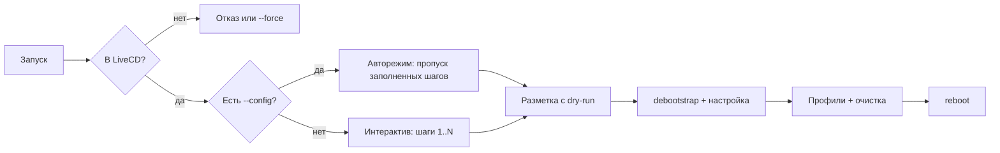

# exdbnein — анализ плана: проблемы и сценарии

> **Архивный документ.** Структурированная версия (решения, статусы, детали этапов) —
> в [`plans/plan.md`](plan.md) и [`plans/phase1.md`](phase1.md) … [`plans/phase9.md`](phase9.md).
> Здесь остаётся исходный сырой анализ.
>
> Документ сверен с актуальным кодом (октябрь 2026). Источник статусов — прежний `plan.md` на корне, фактическое состояние проверено по `src/`.

## 1. Проверка статуса по коду

| Пункт этапа 1 | Статус | Подтверждение в коде |
|---|---|---|
| Тип `InstallConfig` + `defaultConfig` | ✅ | [`src/config/types.ts`](../src/config/types.ts:56) |
| Каркас визарда, отмена Ctrl+C | ✅ | [`src/ui/wizard.ts`](../src/ui/wizard.ts:31), [`src/ui/errors.ts`](../src/ui/errors.ts:2) |
| Хелперы `ui/` с обработкой `isCancel` | ✅ | [`src/ui/prompts.ts`](../src/ui/prompts.ts:17) |
| Save/load JSON, `redact` | ✅ | [`src/config/serialize.ts`](../src/config/serialize.ts:32) |
| Экран-ревью с валидацией | ✅ | [`src/steps/review.ts`](../src/steps/review.ts:23) |
| Хеширование sha512-crypt | ✅ | [`src/utils/password.ts`](../src/utils/password.ts:28) |
| CLI: `--config`, `--profiles-dir`, `--unattended`, `--help` | ✅ | [`src/cli.ts`](../src/cli.ts:25) |
| Навигация «назад» (стек, `StepResult.back`) | ⚠️ механизм есть, UX неполный | [`src/ui/wizard.ts`](../src/ui/wizard.ts:37) — back реализован только в [`disk.ts`](../src/steps/disk.ts:29) и [`users.ts`](../src/steps/users.ts:52) |
| Авторежим `--unattended` | ⚠️ реализован частично | [`review.ts`](../src/steps/review.ts:35) авто-подтверждает; остальные шаги всё равно задают вопросы; хук `Step.skip` не используется |

Итог: **этап 0 и этап 1 формально закрыты**, но два пункта имеют неполную реализацию (см. P1.1, P1.2 ниже). Этапы 2–9 не начаты (в `profiles/` только `.gitkeep`, `livecd/` и `scripts/` отсутствуют, YAML-библиотеки в [`package.json`](../package.json:23) нет).

## 2. Проблемы и риски по этапам

Обозначения: 🔴 высокий (может сломать установку или данные), 🟡 средний, 🔵 низкий.

### Этап 1 — остатки
- **P1.1 🔴 Авторежим неполный.** `--unattended` влияет только на шаг ревью. При полном конфиге `--config` шаги disk/locale/network/users/profiles всё равно зададут вопросы. Решение: в `buildSteps` использовать `Step.skip = (cfg) => cfg.unattended && поле_уже_заполнено`. Это позволит честный kickstart-прогон для этапа 9 (QEMU).
- **P1.2 🟡 «Назад» реализован не единообразно.** Только `disk` и `users` умеют вернуться. locale/network/profiles/review — нет. Сейчас «назад» — это ручная опция внутри `select`/`confirm`, а не системная клавиша. Риск: рассинхрон поведения и дублирование кода. Решение: общий хелпер в `ui/` (например, опция «← Назад» во всех селектах + на ревью пункт «вернуться к шагу N»), шаги приводятся к одному виду.
- **P1.3 🟡 Прогресс сохраняется только при `--config`.** Без флага краш посреди визарда теряет весь ввод ([`src/index.ts`](../src/index.ts:28): `onStepDone` сохраняет, только если задан `options.config`). Решение: автосохранять черновик в `$TMPDIR`/`~/.cache/exdbnein/last.json` и предлагать восстановление при следующем запуске.

### Этап 2 — Профили YAML
- **P2.1 🔴 Нет YAML-парсера.** В зависимостях только `@clack/prompts`. Нужен пакет `yaml` (или свой мини-парсер — не стоит). Добавить в зависимости до старта этапа 2.
- **P2.2 🟡 Конфликты при слиянии.** Правила дедупликации описаны, но не определён случай «два профиля пишут разные файлы по одному пути» и «один пакет в разных профилях». Нужно зафиксировать: конфликт файлов — ошибка валидации; пакеты — union без ошибок. Иначе молчаливый «последний побеждает».
- **P2.3 🟡 Безопасность внешних профилей.** `commands` — произвольный shell в chroot. Встроенные профили доверенные, но `--profiles-dir` может содержать команды с правами root. Перед применением показывать список команд (dry-run) и предупреждать о недоверенном источнике.
- **P2.4 🔵 Порядок применения vs этап 7.** Резолв (топосорт) — сейчас, а применение профилей — этап 7. Стоит сразу хранить «развёрнутый» профиль (flat list) в конфиге/логе, чтобы шаг 7 был детерминирован и повторяем.

### Этап 3 — Окружение
- **P3.1 🔴 LiveCD-маркер надо определить заранее.** План проверяет «наличие LiveCD-маркера», но формат маркера не зафиксирован. Предложение: файл `/etc/exdbnein-live` (создаётся сборкой ISO на этапе 8). Параллельно нужен dev-флаг `--force` (или env `EXDBNEIN_DEV=1`), иначе установщик нельзя запустить на хосте разработчика — этапы 3+ станут нетестируемыми вне LiveCD/QEMU.
- **P3.2 🟡 `lsblk -J`: канонизация путей.** Диск может быть выбран как `/dev/disk/by-id/...`, `/dev/nvme0n1`, `/dev/mmcblk0`; разделы — с суффиксом `pN` (NVMe/MMC) или без (sdX). Парсинг должен опираться на `lsblk -J -o NAME,PATH,SIZE,TYPE,RM,TRAN` и нормализовывать пути. Это же понадобится на этапе 4.
- **P3.3 🔴 Исключение носителя LiveCD.** Если ISO записан на USB и загружен с него, целевой диск = носитель нужно исключать. Учесть: squashfs из memory, `overlay`, `/dev/mapper`, загрузку с CD. Проверять совпадение по `lsblk` mountpoint и по DEVNAME ядра, а не только по имени.
- **P3.4 🟡 Проверка сети.** Таймауты и повтор при недоступном зеркале; спиннер вместо «висящего» TUI. При неудаче — предложить выбрать другое зеркало или продолжить без проверки.

### Этап 4 — Разметка диска
- **P4.1 🔴 BIOS + GPT требует `bios_grub`.** В плане схемы: «GPT + ESP + / (+ swap)» — это UEFI. Для BIOS надо решить: MBR или GPT с разделом `bios_grub`. Рекомендация MVP: BIOS → MBR (проще и стандартно), UEFI → GPT. Зафиксировать в плане.
- **P4.2 🟡 Суффикс `pN` у NVMe/MMC** — классическая ошибка (`/dev/nvme0n1p1`, не `/dev/nvme0n11`). Держать генерацию имён в одном модуле `system/disk.ts` с тестами.
- **P4.3 🔴 Повторный wipe после «назад».** Механизм back (P1.2) опасен на деструктивных шагах: пользователь разметил диск, вернулся, изменил ФС — и снова выполнится wipe. Нужен «guard»: после выполнения деструктивной операции шаг помечается выполненным, повторный back на него либо запрещён, либо требует явного подтверждения «разметка уже выполнена, выполнить заново?».
- **P4.4 🔵 dry-run экран — хорошо, но команды должны быть точными.** Использовать UUID-подписи в `fstab` (см. P5.2), показывать итоговую таблицу разделов с размерами в GiB.

### Этап 5 — Базовая система
- **P5.1 🟡 `debootstrap` и `debian-archive-keyring`.** В LiveCD должны присутствовать оба; зеркало по умолчанию `deb.debian.org` ок, но в офлайне нужен понятный отказ.
- **P5.2 🔴 `fstab` — по UUID**, не по `/dev/sdX` (имена меняются между перезагрузками). Генератор или `genfstab -U`.
- **P5.3 🟡 Для UEFI `grub-install` внутри chroot нужен bind-mount `/sys/firmware/efi/efivars`** — легко забыть при монтировании `/proc /sys /dev /run`. Включить в список обязательных монтирований.
- **P5.4 🟡 Долгие операции и Ctrl+C.** `debootstrap`/`apt` идут минуты. При Ctrl+C во время `exec()` дочерний процесс может осиротеть. Решение: единый модуль `system/run.ts` с прогрессом, лимитом времени и kill-группой процесса при отмене.

### Этап 6 — Настройка системы
- **P6.1 🟡 debconf в неинтерактивном режиме.** `locales`, `console-setup`, `keyboard-configuration`, `tzdata` требуют пресетов `DEBIAN_FRONTEND=noninteractive` + `debconf-set-selections`, иначе chroot-установка зависнет на вопросе.
- **P6.2 🔵 os-prober медленный и чувствителен к EFI-переменным в QEMU.** Сделать опцией, по умолчанию выключен или с таймаутом.
- **P6.3 🔵 Права на `~/.ssh` и `authorized_keys`** (700/600) — иначе sshd откажет.

### Этап 7 — Пост-установка
- **P7.1 🔴 Пути файлов профилей.** `files` указывают абсолютные пути в целевой системе, но записывать нужно в целевой корень (`/mnt/etc/...`), а `commands` выполняются в chroot (видят `/etc/...`). Два разных «пространства путей» — задокументировать в схеме профиля и в коде сделать явное разделение (writer vs chroot runner).
- **P7.2 🔴 Нет rollback.** После разметки и partial-установки пакетов нет отката. Стратегия: понятный отчёт об ошибке + возможность повторного запуска поверх готовой разметки (идемпотентный вход), лог шагов в `/var/log/exdbnein/install.log` на LiveCD-носителе (или в память).
- **P7.3 🟡 Очистка при ошибке.** Размонтирование `/mnt` и `swapoff` должны идти в `finally`, а не только в happy-path.

### Этап 8 — LiveCD
- **P8.1 🟡 `bun build --compile` не упаковывает YAML-ассеты.** Профили придётся либо компилировать в TS-модули (инлайн), либо класть рядом с бинарём в ISO и искать относительно исполняемого файла. Решить на этапе 8; этап 2 может влиять на формат.
- **P8.2 🟡 Маркер LiveCD создаётся здесь же** (см. P3.1) — согласовать путь маркера сейчас.
- **P8.3 🔵 Кастомный init вместо live-boot — объёмно.** Для MVP рассмотреть live-boot/live-config и кастомный systemd-юнит автозапуска, а не собственный init.

### Этап 9 — Тесты
- **P9.1 🟡 QEMU-прогон строится на честном `--unattended`** — упирается в P1.1. Нужен `scripts/qemu-test.sh` + serial console для автоматизации (`-serial stdio`, конфиг-файл с полным `InstallConfig`).
- **P9.2 🔵 Юнит-тесты для парсинга `lsblk`, генератора fstab, резолва профилей** — уже в плане; добавить тесты на суффиксы разделов (P4.2) и merges (P2.2).
- **P9.3 🔵 CI.** Оставить typecheck/lint/test; QEMU-прогон — отдельный ночной job, чтобы не замедлять PR.

## 3. Ключевые сценарии

- **S1 Happy path (интерактив).** Проход по шагам, ревью показывает план, подтверждение, установка, reboot. Ожидание: `--config` сохраняет промежуточный прогресс (P1.3).
- **S2 Навигация назад.** С `disk`/`users` работает; с остальных шагов — нет (P1.2). После деструктивной разметки back должен блокироваться (P4.3).
- **S3 Ctrl+C.** До начала установки — чистый выход 130. Во время `debootstrap` — kill-группа дочерних процессов (P5.4); частичный результат — через отчёт (P7.2).
- **S4 Краш/выключение посреди установки.** Целевой диск частично размечен/установлен. Повторный запуск должен распознать «уже размечено» и продолжить (идемпотентность), а не переспрашивать.
- **S5 Недоступное зеркало/сеть.** `debootstrap` падает с понятной ошибкой; предложить другое зеркало; лог для диагностики (P3.4).
- **S6 Ошибка выбора диска.** Выбран носитель LiveCD — установщик должен отказаться до любых деструктивных действий (P3.3). Двойное подтверждение wipe.
- **S7 UEFI vs BIOS.** UEFI → GPT+ESP+btrfs; BIOS → MBR+ext4 (решение P4.1). Физически разный набор команд `grub-install`; проверить оба в QEMU (этап 9).
- **S8 Авторежим `--config --unattended`.** Ожидание: ни одного вопроса при полном конфиге; при неполном — понятная ошибка с указанием недостающих полей (сейчас валидация умеет только в ревью).
- **S9 Конфликты профилей.** Валидация ловит до установки (P2.2); dry-run показывает итоговые пакеты/команды/файлы.
- **S10 Запуск на хосте разработчика.** Без LiveCD-маркера — только `--force`/dev-режим (P3.1), чтобы этапы 3+ можно было гонять локально.

## 4. Открытые вопросы — предлагаемые решения

| Вопрос из plan.md | Предложение |
|---|---|
| Загрузчик: GRUB или ещё systemd-boot? | MVP — только GRUB; systemd-boot отложить (меньше веток в этапах 4/6/8) |
| Авторежим в MVP? | Да, но как «конфиг обязателен и полон»; без интерактива. Упирается в P1.1 |
| Снапшоты btrfs «из коробки»? | Только subvolumes `@`, `@home`, `@snapshots`; snapper/timeshift — пост-MVP |
| Условия/переменные в профилях? | Оставить статичными в MVP (уже решено) |
| BIOS-разметка | MBR для MVP (P4.1) |
| Маркер LiveCD | `/etc/exdbnein-live` + dev-флаг `--force` (P3.1) |

## 5. Что сделать в первую очередь

1. **Закрыть этап 1 честно**: `Step.skip` для `--unattended` (P1.1), единый «назад» во всех шагах (P1.2), автосохранение черновика (P1.3).
2. **Этап 2**: добавить YAML-зависимость, зафиксировать правила слияния и конфликтов, покрыть резолв тестами (P2.1–P2.4).
3. **Зафиксировать решения-предтечи**: маркер LiveCD + dev-режим (P3.1), схема BIOS (P4.1), «пространства путей» в профилях (P7.1) — они влияют на несколько этапов сразу.